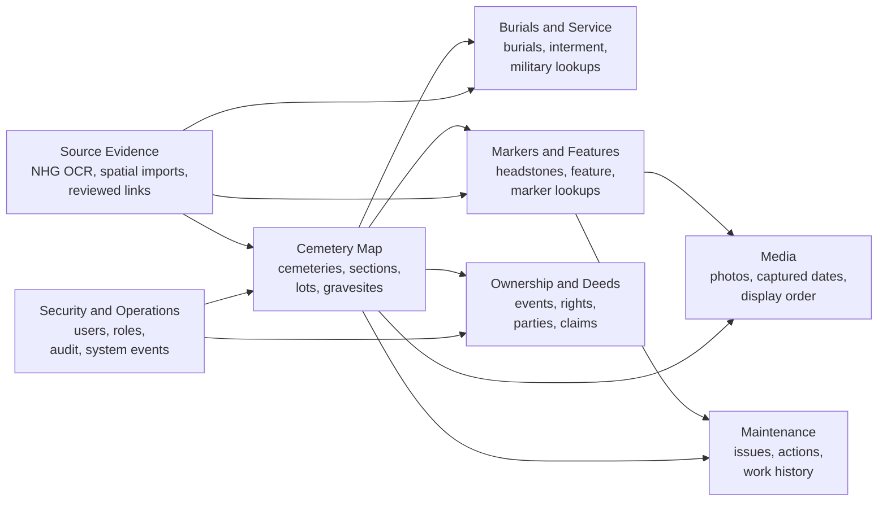
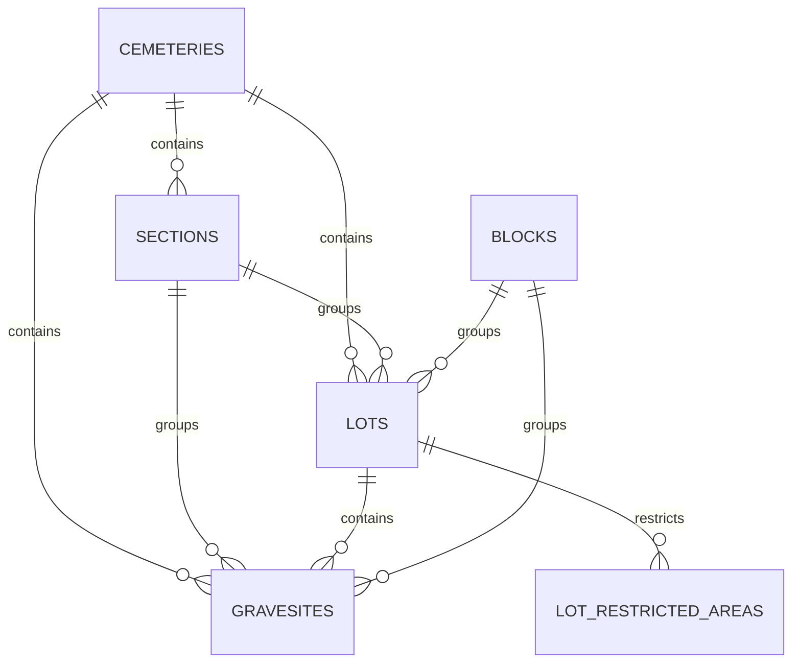
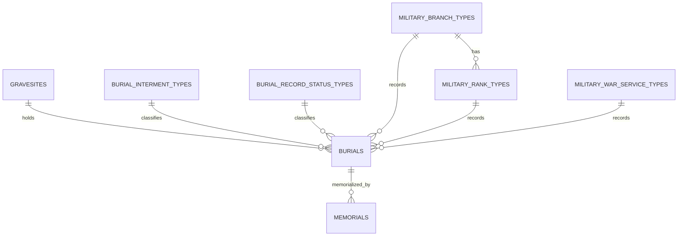
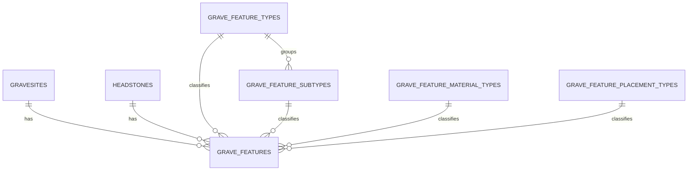
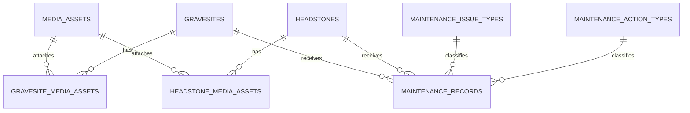
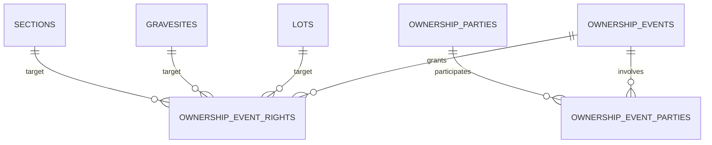
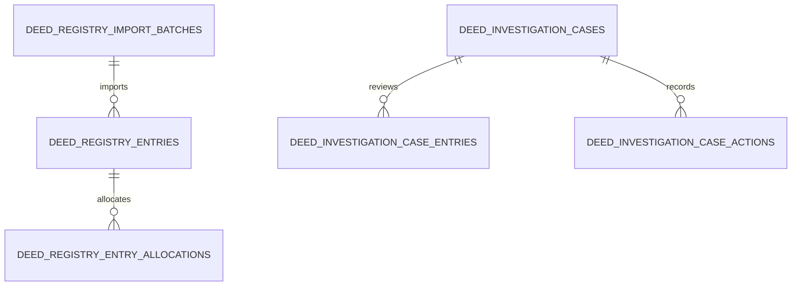
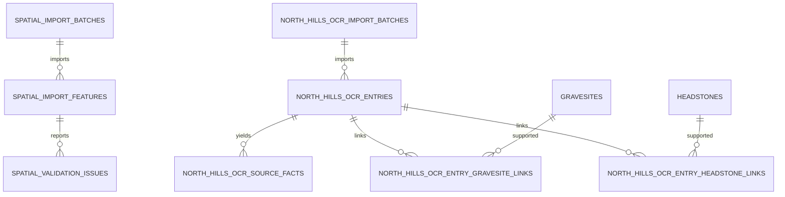
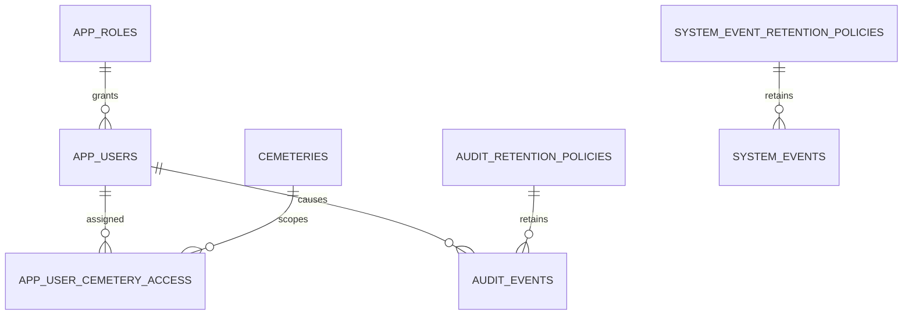

---
---

# Data Model

The Cemetery Mapping database is a PostgreSQL/PostGIS schema managed by Liquibase. It stores operational cemetery records, map geometry, source evidence, ownership history, media, maintenance work, security, auditing, and system events in one place.

This page is a logical guide to the schema. It is not meant to list every column. For the exact schema, use the Liquibase changesets in `db/changelog/changes`.

## Design Principles

- `cemeteries` is the main tenant and facility boundary. Most user-visible records are scoped to a cemetery directly or through a cemetery-owned parent.
- Geometry tables store the current operational map. Evidence and import tables preserve where that information came from.
- Lookup tables drive dropdowns and controlled values so common fields do not drift into inconsistent free text.
- Link tables model many-to-many relationships, such as one marker spanning multiple gravesites or one marker naming multiple burials.
- Soft deletes preserve cemetery records when removal has business meaning. Normal reads exclude deleted rows; admin and audit workflows can inspect them.
- Audit and system-event tables are separate. `audit_events` records data changes, while `system_events` records operational failures, jobs, and health events.

## Data Domains

The schema is easier to understand as a set of connected domains instead of one all-in diagram. The map and inventory tables sit in the center. Other domains either describe what is in those mapped places, attach evidence to them, or govern who can change them.



## Cemetery Map And Inventory

These tables hold the current operational map and cemetery inventory.



| Table | Purpose |
| --- | --- |
| `cemeteries` | Top-level cemetery/facility record and boundary geometry. User access and most reporting are scoped from here. |
| `sections` | Named cemetery sections, including aliases and notes. Sections group lots and gravesites and can carry boundary geometry. |
| `blocks` | Optional subdivision between section and lot when a cemetery uses blocks. Many cemeteries leave this empty. |
| `lots` | Deed or purchase units. Lots may contain multiple gravesites and may use diagram geometry when readable lot layout matters more than survey-grade boundaries. |
| `gravesites` | Individual interment spaces. This is the central map feature for availability, occupancy, burial association, and many detail-panel workflows. |
| `gravesite_status_types` | Controlled statuses such as available, occupied, sold, reserved, needs review, and unknown. |
| `lot_restricted_areas` | Areas within a lot where gravesites and markers are prohibited. These support operational restrictions without pretending the lot does not exist. |
| `historic_lot_map_gravesite_evidence` | Reviewed evidence connecting historic lot diagrams to gravesite layout decisions. |

Geometry is stored in PostGIS using EPSG:4326. The application also stores geometry metadata such as geometry type, source, confidence, and review notes so users can distinguish GPS evidence, reviewed diagram geometry, and estimated operational geometry.

## Burials, People, And Military Service

Burial records connect people to gravesites, but they also preserve uncertainty. A marker can name a living person, a burial can have partial date information, and a grave can be sold or reserved without containing a burial.



| Table | Purpose |
| --- | --- |
| `burials` | Person/burial facts associated with a gravesite, including names, date display values, interment type, record status, veteran status, branch, rank, and war service. |
| `burial_interment_types` | Dropdown values for interment method, such as casket or cremation. |
| `burial_record_status_types` | Distinguishes normal burials from records such as living/pre-need marker entries. |
| `military_branch_types` | Controlled branch/service values, including non-branch veteran organizations used by source records. |
| `military_rank_types` | Branch-specific rank values. Ranks are tied to a military branch because branches do not all use the same rank names. |
| `military_war_service_types` | Controlled values for wars or service periods. |
| `memorials` | Point memorial records linked to burials when a memorial is separate from the primary headstone workflow. |

Partial dates should be stored as known precision, not forced into fake dates. For example, `1929` should remain a year-only value rather than becoming `1929-01-01`.

## Markers, Features, Photos, And Maintenance

Markers and gravesites can each have their own physical condition, photos, and features. The schema keeps these concepts separate so a marker can span more than one gravesite and a feature can belong to either the grave, the marker, or both.

```mermaid
erDiagram
  HEADSTONES ||--o{ HEADSTONE_GRAVESITES : marks
  GRAVESITES ||--o{ HEADSTONE_GRAVESITES : marked
  HEADSTONES ||--o{ HEADSTONE_BURIALS : names
  BURIALS ||--o{ HEADSTONE_BURIALS : named
  HEADSTONES ||--o{ HEADSTONE_RELATIONSHIPS : from
  HEADSTONES ||--o{ HEADSTONE_RELATIONSHIPS : to
  MARKER_TYPES ||--o{ HEADSTONES : classifies
  MARKER_MATERIAL_TYPES ||--o{ HEADSTONES : classifies
  HEADSTONE_CONDITION_TYPES ||--o{ HEADSTONES : classifies
```





| Table | Purpose |
| --- | --- |
| `headstones` | Marker/headstone point geometry and marker metadata. The name is historical in the schema; the UI generally calls these markers. |
| `headstone_gravesites` | Many-to-many link between markers and gravesites. This supports shared family markers and markers spanning adjacent graves. |
| `headstone_burials` | Many-to-many link between markers and the burials or named people shown on them. |
| `headstone_relationships` | Marker-to-marker relationships, such as family obelisk references, common-base relationships, foot markers, and other physical marker references. Plot markers should become actual marker records before they are related here; gap notes remain observations rather than marker relationships. |
| `marker_types` | Marker form/type dropdown values, such as upright, flat, pillow, military marker, cradle grave, and other local marker types. |
| `marker_material_types` | Controlled marker materials. |
| `headstone_condition_types` | Controlled marker condition values. |
| `headstone_vase_types`, `headstone_vase_material_types`, `headstone_vase_placement_types` | Marker vase classification fields used when a vase is part of the marker record. |
| `grave_features` | Physical features such as vases, flag holders, veteran star holders, flower holders, and similar items. A feature can link to a gravesite, a marker, or both. |
| `grave_feature_types`, `grave_feature_subtypes`, `grave_feature_material_types`, `grave_feature_placement_types` | Feature dropdown values and classification hierarchy. |
| `media_assets` | Uploaded media metadata, including upload information and captured-at dates read from EXIF or entered manually. |
| `gravesite_media_assets`, `headstone_media_assets` | Ordered photo/link tables for gravesites and markers. These allow multiple photos without duplicating the media record itself. |
| `maintenance_records` | Dated issue/action history for gravesites and markers, such as cleaned, repaired, listing, broken, illegible, grass needed, or leveling needed. |
| `maintenance_issue_types`, `maintenance_action_types`, `maintenance_priority_types` | Controlled maintenance categories for reporting and work queues. |

Maintenance is history, not just a current attribute. That lets reports answer questions such as which markers have not been cleaned recently and which open issues still need work.

## Ownership, Deeds, And Claims

Ownership is modeled as history because deeds, transfers, partial rights, and unlocated claims need provenance. Older lot-only ownership tables still exist for compatibility, while newer generalized ownership tables can target lots, gravesites, sections, or unlocated rights.





| Table | Purpose |
| --- | --- |
| `ownership_events` | Generalized deed, transfer, claim, or administrative ownership event. |
| `ownership_event_rights` | The specific thing an ownership event affects: a lot, gravesite, section, or unlocated right. |
| `ownership_parties` | People or organizations participating in ownership events. |
| `ownership_event_parties` | Links parties to ownership events with their roles. |
| `current_ownership_events`, `current_ownership_right_owners` | Views that present the current effective ownership state for application queries. |
| `lot_ownership_events`, `lot_owner_parties`, `lot_ownership_event_parties` | Legacy lot ownership model retained during the transition to generalized ownership rights. |
| `owners` | Legacy gravesite owner rows used by older workflows and compatibility reads. |
| `deed_registry_import_batches`, `deed_registry_entries`, `deed_registry_entry_allocations` | Imported deed registry evidence and parsed allocations. |
| `deed_investigation_cases`, `deed_investigation_case_entries`, `deed_investigation_case_actions` | Admin investigation workflow for claims where the paperwork or location is incomplete. |

This structure avoids flattening ownership into a single "current owner" column. Current ownership can be derived for display, while the event history remains available for audit and research.

## Source Evidence And Imports

The application deliberately separates staged source evidence from authoritative operational records. That lets administrators review source material, promote useful facts, and still keep the original wording.



| Table | Purpose |
| --- | --- |
| `spatial_import_batches` | A raw spatial import run from a source such as an Esri File Geodatabase or shapefile. |
| `spatial_import_features` | Source spatial features, original properties, source identifiers, and normalized geometry before promotion. |
| `spatial_validation_issues` | View that reports geometry and containment issues before spatial data is promoted. |
| `north_hills_ocr_import_batches` | A North Hills Genealogists OCR import run. |
| `north_hills_ocr_entries` | Staged NHG entries with raw text, parsed location, marker descriptors, surnames, years, and review state. |
| `north_hills_ocr_source_facts` | Extracted facts from CR, CRG, SK, and similar annotations. These can support or update operational records after review. |
| `north_hills_ocr_entry_gravesite_links`, `north_hills_ocr_entry_headstone_links` | Reviewed links between NHG evidence and the operational gravesites or markers it supports. |

Keeping evidence separate from operational rows is especially important for NHG corrections. The OCR text can be corrected and reviewed without immediately overwriting burial, marker, or gravesite records. When an NHG entry says one marker refers to another, such as an obelisk reference or common-base note, the reviewed operational relationship belongs in `headstone_relationships` rather than only in free text.

## Users, Roles, Audit, And Operations

Security and operational observability are part of the database model because the cemetery records need accountability.



| Table | Purpose |
| --- | --- |
| `app_roles` | Application roles: `reader`, `power-user`, `cemetery-admin`, and `admin`. |
| `app_users` | Local application user records mapped to Auth0 or trusted-header identities. The application database remains the source of truth for role and active status. |
| `app_user_cemetery_access` | Cemetery assignments for scoped users. Non-admin users can only query or edit the cemeteries assigned to them. |
| `audit_events` | Append-only row-level history written by database triggers for authoritative business/admin tables. |
| `audit_retention_policies` | Retention and purge settings for audit rows. |
| `system_events` | Operational events such as unexpected API errors, health checks, job runs, warnings, and integration failures. |
| `system_event_retention_policies` | Retention and purge settings for system events. |

Direct database users should mirror the application role model where possible. That improves audit quality because direct changes can be attributed to named database accounts instead of shared credentials.

## Lookup Tables

Lookup tables are intentionally numerous. They keep dropdown values consistent, make reports easier to write, and allow the application to add domain-specific values without changing every operational row.

Common lookup groups include:

- Burial classification: `burial_interment_types`, `burial_record_status_types`
- Military service: `military_branch_types`, `military_rank_types`, `military_war_service_types`
- Marker classification: `marker_types`, `marker_material_types`, `headstone_condition_types`
- Vase and feature classification: `headstone_vase_*`, `grave_feature_*`
- Maintenance classification: `maintenance_issue_types`, `maintenance_action_types`, `maintenance_priority_types`
- Ownership classification: `lot_ownership_event_types`

When a user-facing field is a stable controlled list, prefer a lookup table. When the field must preserve source wording, uncertainty, or one-off notes, prefer a text/note field linked to source evidence.

## Where To Make Schema Changes

Schema changes should be made with a new Liquibase changeset under `db/changelog/changes` and included from `db/changelog/db.changelog-master.xml`. Update this page when a change adds a new table group, changes a relationship, or changes the purpose of an existing table.

Related documentation:

- [Database Auditing](database-auditing.html)
- [Data Sources](data-sources.html)
- [Admin Workflows](admin-workflows.html)
- [ADR 0015: Generalized Ownership Rights](adr/0015-generalized-ownership-rights.html)
