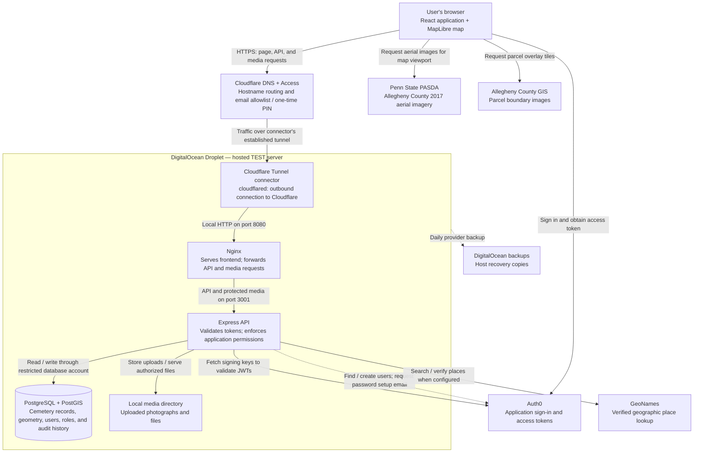
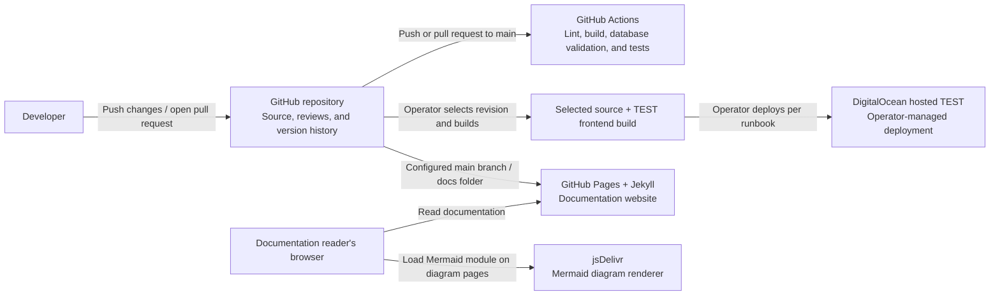

---
---

# Application and Third-Party Services

This overview describes the services connected to Cemetery Mapping, based on the
repository configuration and the [Hosted TEST runbook](hosted-test.md). The hosting
diagram represents **hosted TEST** at `test.nhcemeteries.org`; it is not a claim
that STAGE or PROD is deployed. Local DEV runs the frontend, API, database, and
media locally without the hosted Cloudflare gateway.

## Application, hosting, and external data

Arrows show the direction of a request or action; responses return along the same
connection. Dashed arrows show optional provisioning and backup operations.

Nginx delivers the frontend files to the browser, where React and MapLibre run.
Authenticated browser API calls carry an Auth0 access token through Cloudflare
and Nginx to Express. The database and media directory stay on the Droplet;
Cloudflare and Auth0 do not store the application's cemetery records.

## Service names, relationships, and purposes

| Service | Connects to | Purpose and scope |
| --- | --- | --- |
| **Cloudflare DNS** | Browser → hosted hostname | Routes the TEST hostname to the Cloudflare Tunnel. |
| **Cloudflare Access** | Browser → application gateway | Checks the hosted TEST email allowlist using an emailed one-time PIN before allowing protected traffic. This is separate from Auth0 login. |
| **Cloudflare Tunnel** | Cloudflare edge ↔ `cloudflared` → Nginx | The connector establishes an outbound tunnel from the Droplet, allowing Cloudflare to reach the loopback web listener without exposing public web or database ports. |
| **DigitalOcean Droplet** | Hosts Nginx, Express, PostgreSQL/PostGIS, media, and the tunnel connector | Keeps hosted TEST available independently of the developer's computer. Docker Compose runs the application services on this server. |
| **DigitalOcean backups** | Droplet → provider backup storage | Supplies daily host recovery copies. The local backup script also creates logical database dumps; a separate offsite media/database copy remains follow-up work. |
| **Auth0 Authentication API / Universal Login** | Browser ↔ Auth0; API → Auth0 signing keys | Authenticates application users and issues tokens. Express checks the token's issuer, audience, and signature, then resolves application access from PostgreSQL. |
| **Auth0 Management API** | Express → Auth0 | When server credentials are configured, Admin → Users can find or create an identity in the matching environment's tenant. Hosted TEST has this enabled. |
| **Auth0 email delivery** | Auth0 → user's email inbox | Supports verification and password setup/reset emails. Hosted TEST email configuration is enabled, but real tester delivery still needs verification. The repository does not identify a separate SMTP provider. |
| **Penn State PASDA (ArcGIS REST)** | Browser → `imagery.pasda.psu.edu` | Provides Allegheny County 2017 aerial imagery behind the application's cemetery geometry. |
| **Allegheny County GIS (ArcGIS REST)** | Browser → `gisdata.alleghenycounty.us` | Provides the parcel boundary overlay. Both map image services are requested directly by the browser, outside the application API. |
| **GeoNames** | Express → `secure.geonames.org` | Searches and verifies geographic places for death-location entry. Requires `GEONAMES_USERNAME`; existing locally verified places remain available if it is absent or the service fails. |

React, MapLibre, Express, Nginx, Docker, PostgreSQL/PostGIS, and Liquibase are
software components or tools, rather than separately hosted application service
accounts. MapLibre renders the map in the browser; the external ArcGIS services
supply imagery and parcels, while the application supplies cemetery geometry.
Find a Grave URLs are record links, not an API integration. Imported spreadsheets,
scans, and Esri geodatabases are source files; see the [Data Source Register](data-sources.md).

## How access works

1. **Cloudflare Access admits the visitor to hosted TEST.** The email must be on
   its allowlist. The public access-request page, its assets, and the submission
   endpoint have narrowly scoped exceptions.
2. **Auth0 signs the user into the application.** The browser obtains an access
   token from the environment's Auth0 tenant and includes it in API requests.
3. **Express checks identity and application permissions.** An active `app_users`
   record, its role, and cemetery assignments determine which records and actions
   the user can access. Passing Cloudflare or signing into Auth0 alone does not
   grant cemetery access.

An administrator approves requests in the application and can provision an Auth0
identity. They must **also add the approved email to Cloudflare Access manually**;
application approval does not synchronize the gateway allowlist. No automatic
email notification to administrators is currently sent for new access requests.
See [Requesting and Approving Access](access-requests.md) for the full workflow.

DEV, TEST, STAGE, and PROD require separate Auth0 tenants and separate application
data and credentials. STAGE and PROD resources must be provisioned before deployment.

## What changes for production?

The expected production baseline uses the same relationships shown above:
Cloudflare routes traffic to the application server, Auth0 handles application
sign-in, and Express accesses PostgreSQL/PostGIS and media. Production hosting
has not yet been provisioned; this is a baseline for planning, not a deployed
production design.

| Area | Hosted TEST today | Production requirement or decision |
| --- | --- | --- |
| Identity and data | Dedicated TEST Auth0 tenant, database, media, and credentials | Provision separate PROD identity settings, database, media, credentials, and hostname. |
| Gateway login | Cloudflare Access email allowlist and one-time PIN, followed by Auth0 login | Decide whether to retain this additional gateway login. Active application accounts and application permissions remain required. |
| Hosting | One DigitalOcean Droplet with Docker Compose | A similar single-server deployment is a possible starting point. Server sizing, managed database, separate media storage, and redundancy remain deployment decisions. |
| Recovery | Provider backups and local logical database dumps; separate offsite copy remains follow-up work | Establish separate offsite database/media copies and verify restoration before launch. |
| Operations | Persistent hosted testing | Establish monitoring and capacity for production usage; validate releases in TEST and rehearse in STAGE before promotion. |

See [Operator Workflows](operator-workflows.md#environment-promotion-workflow)
and the [Auth0 Production Checklist](auth0-production-checklist.md). Update the
diagram when production deployment decisions are accepted.

## Development and documentation services

These services support development or the documentation website, rather than
handling cemetery API requests.

| Service | Relationship and purpose |
| --- | --- |
| **GitHub repository** | Holds application code, documentation, migrations, and reviewed changes. |
| **GitHub Actions** | Runs CI on pushes and pull requests to `main`, including database rebuild checks and browser tests. The current workflow does not deploy hosted TEST automatically. |
| **GitHub Pages / Jekyll** | The documentation is configured to publish from `main` and `/docs` when enabled in repository settings. This is separate from application hosting. |
| **jsDelivr** | The documentation layout loads Mermaid 10 to render diagrams in the reader's browser. If this CDN cannot load, the Markdown diagram source remains available in the repository. |

## Where to find the implementation

- [Hosted TEST](hosted-test.md) and [ADR 0073](adr/0073-private-hosted-test.md): hosting and environment isolation.
- [Auth0 Test Tenant](auth0-test-tenant.md) and [Auth0 Production Checklist](auth0-production-checklist.md): identity setup.
- [`deploy/test/compose.yaml`](../deploy/test/compose.yaml) and [`nginx.conf`](../deploy/test/nginx.conf): server components and routing.
- [`server/auth.mjs`](../server/auth.mjs) and [`auth0Management.mjs`](../server/auth0Management.mjs): token validation and identity provisioning.
- [`server/placeSearchService.mjs`](../server/placeSearchService.mjs): GeoNames requests.
- [`src/components/cemeteryMapLayers.ts`](../src/components/cemeteryMapLayers.ts): external imagery and parcel requests.
- [CI workflow](../.github/workflows/ci.yml) and [documentation layout](../docs/_layouts/default.html): development checks and Mermaid loading.

Update this overview when a service, hosting arrangement, or integration changes.
